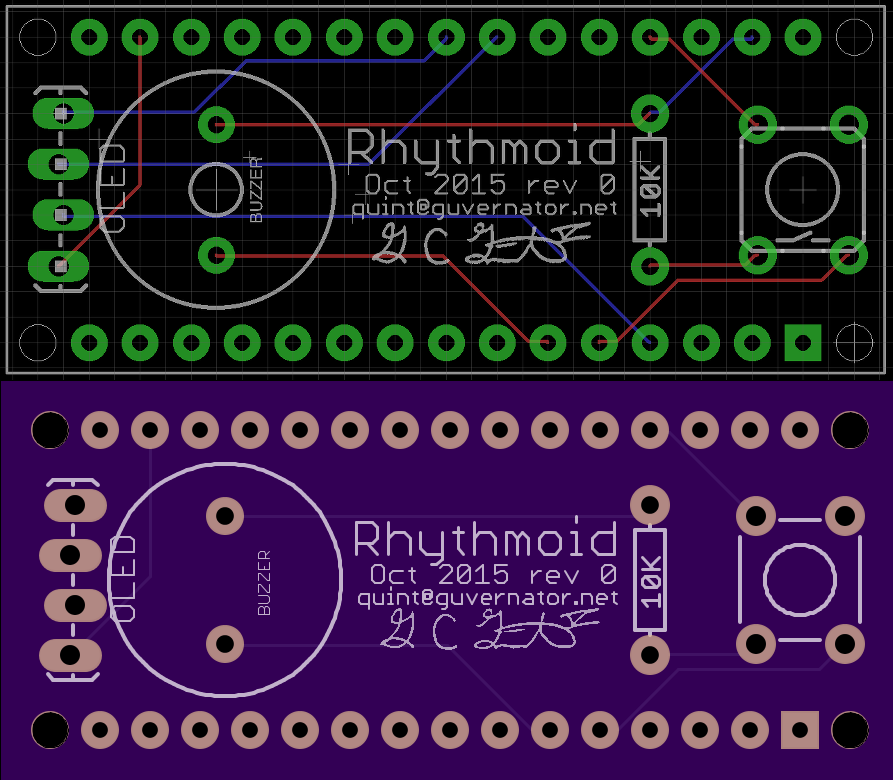

# mtk
_mobile/modal tool kit: a collection of useful little Arduino (Nano) programs with a menu_

I was making an Arduino rhythm game when I realized that the biggest memory hog is u8glib. Since this only needs to be imported once, loads of additional code fit fairly easily fit in memory even on the nano/micro/pro micro/etc. So it grew into a bit of an assortment of tools.

The project is designed especially to be accessable to blind/deaf users. All menus have visual and audio cues for navigation.

Blind users: Beeps of different tones can help you navigate the menus and play the game.
See the section below entited "For blind users and developers" to learn how to nagivate the menus through sound cues alone.

## Parts

  - [Arduino Nano](https://www.arduino.cc/en/Main/ArduinoBoardNano) or compatible device; if you're not using the custom shield PCB, any Arduino will work
  - headers for the above; one male set for the Nano and one female set for the shield, if you're using it
  - [128x64 I2C OLED display](http://www.hobbyelectronica.nl/product/128x64-oled-geel-blauw-i2c/)
  - a little button, normally open, closes on push; SPST/DPST/nPST-NO should be fine
  - a piezo buzzer that doesn't oscillate on its own, i.e. when you give it DC, it shouldn't make sustained noise
  - ~10kΩ resistor (anything is fine, even 1k will do, you're just pulling down, but higher impedence means less unnecessary power consumption)

## Wiring

Look at [the included Eagle files](eagle/). Here's a short explanation:

  - power (3.3v for mine) and ground the OLED display
  - attach SCL to analog pin 5 and SDA fo analog pin 4
  - make a voltage divider with 5V and the 10kΩ resistor, and make the button interrupt current from 5V to the resistor
  - connect the not-5V side of the switch to digital pin 2; this tells the board whether we're pressing the button
  - connect the (admittedly optional) buzzer to digital pin 3 and ground; add a resistor if it's too loud
  - power the board with at least 5V DC unless your board supports 3.3V

## Shield PCB

Pictured above; will add pictures of the finished product once I'm through building one. If you like the board as it is, you can [order it from OSH Park](https://oshpark.com/shared_projects/O3bcMjo5) without having to bother with EAGLE. I haven't tested it yet; I've only just ordered it myself! I don't get any money from your order; OSH Park is a simple group ordering service, and my design is open anyway.

# For blind users and developers

Here is extremely detailed information on menu sound cues and other technicalities.

## The main menu

After displaying information on time/date of compilation, the main menu will appear, allowing you to select one of many different operating modes. Tap the button to iterate through the menu. Each tap produces a "low" beep. A "high" beep is produced after you cycle past the last menu item, returning you to the first menu item. The items, in order, are:

  - Play a rhythm game
  - Measure tempo
  - Collect entropy
  - View info
  - Toggle sound

When you return to the main menu, you are placed at the title of the menu you just left. When you return from "view info", for instance, the main menu will display "view info", meaning you would tap once to select "toggle sound", twice to select "play a rhythm game", etc.

## Rhythm game gameplay

A tempo will be chosen pseudo-randomly between 60 (like a clock) and 180 (like Dutch hardstyle). The board will count eight beats at that tempo. The beeps are like a metronome: beats "1" and "5" are high, all the others are low. High low low low high low low low. You then tap out the next eight beats at the same tempo. The screen then indicates how far, in milliseconds, you ended up drifting from the tempo. It will then beep high, indicating that you can choose between either playing again at the same tempo (tap the button) or returning to the main menu (hold the button).

I'd like to expand this so that statistics are somehow given through audio. I'd also like to provide more sophisticated analysis than just 8th-beat drift.

Some specifics:

  - you can pause between the machine's 8 beats and your 8 beats--it won't count against you
  - the only thing that's (currently) measured is the first and last beats; you can rush through beats 2 through 7 and it won't count against you as long as you end up pressing beat 8 at the right time
  - the game always repeats at the same tempo until you return to the menu
  - the score is accurate to 4μs, but button pressing is not
  - the calls to `delay()` are specially designed to be very precise, on the order of 4μs or so (depending on the board), and account for screen-blit time, sound playback time, pin read/write time, calculation time, etc.

## Measuring tempo

Press the button once per beat. A current last-four-beat average will display in beats per minute on the screen. If there is more than about one second between beats, "Return?" will appear under the current tempo and a high tone will play. After this tone, you can hold to return to the main menu.

## Using the entropy generator

You can choose a base in the same way that you choose main menu items: tap to iterate and hold to select. The last item gives a higher beep than the others, indicating that you're moving to the first element again.

The bases, in order, are: 10, 16, 6, 20, 12, 64, 7. After 7 comes an option to "go back"; when the button is held here, you can return to the main menu.

Once you've held the button to select a base, the screen displays the base you chose and fills the rest of the screen with random digits in that base. Tap to generate a new screen of entropy; hold to return to the base selection screen. Note: the base selection screen always starts at 10 and does _not_ return you to your last choice, like the main menu.

The random number generator is _farily okay_. If you can ensure that analog pin zero isn't connected to any other components (PCBs notwithstanding), than the generation is the best possible without serious external hardware (a geiger counter). It uses the least significant bits of analogue reads to generate a `long int` to seed the Arduino random generation function.

  - tap to iterate through bases, hold to select and generate a screen's worth of entropy
  - you can generate another screen by simply tapping, or hold to return to base selection
  - select "Go back" after the last base to return to the main menu

## Information mode

Tap to switch screens; hold to return to the main menu. Low beep when cycling through; high beep when returning to the first element. The following information is displayed on screen at each press:

  - Made by: Quint Guvernator [github qguv/mtk](https://github.com/qguv/mtk)
  - Made at: [revspace.nl](http://revspace.nl) Hackerspace Den Haag
  - Return to: Stamkartstraat 117 2521EK Den Haag

## Turning sound on/off

Activating the fourth menu option enables or disables sound. The start-up chime will always be on. When sound is being enabled, a longer-than-normal rising chime plays. When sound is being disabled, a longer-than-normal falling chime plays.

If sound is disabled, you can re-enable it by doing the following:

  - Turn the device on
  - Tap the button four times
  - Hold the button

If this was successful, you will hear the longer-than-normal rising chime.

## Development todo

  - unify all menu code so it's easier to program menus with consistent operation and sound cues
  - unify all press-to-count cues (part two of rhythm game + tempo counter)
  - chronograph
  - count up
  - more sophisticated statistics in the rhythm game
  - a more sophisticated rhythm game
  - more modes!
